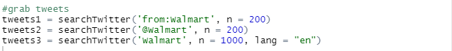

# BMI & Nutrition Calculator

<!-- TABLE OF CONTENTS -->

  
Table of Contents

  <ol>
    <li>
      <a href="#about-the-project">About The Project</a>
      </ul>
    </li>
    <li>
      <a href="#getting-started">Getting Started</a>
      </ul>
         <li><a href="#packages">Packages</a></li>
        <li><a href="#connection">Connection</a></li>
        </ul>
    </li>
    <li><a href="#twitter-api-setup">Twitter API Setup</a></li>
    <li>
      <a href="#scraping-tweets">Scraping Tweets</a>
      <ul>
        <li><a href="#scraping-methods">Scraping Methods</a></li>
        <li><a href="#data-frame">Data Frame</a></li>
        <li><a href="#columns">Columns</a></li>
      </ul>
    </li>
  </ol>

## About The Project

This project was built with RStudio as a means to webscrape tweet off twitter. This  can also be commonly doen in Python, but for I prefer the method of using R to scrape this data and conduct anaylsis. Because of Twitter rules the API only allow scraping of tweets from only as far back as a week ago. This is more that enough though to see current information and make various anaylsis on it which we will be doing here in the form of correlation, sentiment anaylsis and word clouds.

## Getting Started

Make sure you have excel downloaded. If not this should work on the microsofts free online version, the only diffirence is that you cannot edit the vba code there. Make sure macros are enabled in order to run the code.

### Packages

  

### Connection

## Twitter API Setup

In order to setup the API we first need to go to the[Twitter Developer site](https://developer.twitter.com/en) and create and account. Don't worry this is all free and all you need to do is input some info on your project and agree to terms. The 4 main things we will need are, `API key`, `API secret`, `Acess Token`, and `Acess Token secret`. These will be given to us in the developer and our all uniqure to us so do not share it with anyone else. You will be pasting those keys/codes into quotes containg `X`.

  

After all that running this you should see them those 4 as values on the right side in environments. If in the console line it asks to use a local file to cache, type "2" to select No and enter.

## Scraping Tweets

### Scraping Methods

There are three main methods we will be looking at on how to scrape tweets. Getting tweets from that person directly, getting tweets from people "@" tht person or tweets containing there name or keyword.

  

For this example I will be using Walmart and using the 3rd method only and only getting tweets containing the word "Walmart".

### Data Frame
Here we will turn those tweets into a data frame to use it and see it much easier.

  

### Columns
When we view the data frame we will see there are alot of diffirent data info/columns. The ones we only realy want are the `ScreenName`(The person tweeting), and `Text`(tweet itself).

  

In the `FoodList` table you will see hundred of various food items with there according measurments which equates to 1 portions. If there is a food item on there you wish to add click on the button to add it and a messagebox will popup asking you to input its according information.

### Food Record
In the `DailyRecord` page you will see a table of all the foods items you saved in the food entry page. The information here is then visualized in the `FoodPivot` page . Click the `Reset` button if you wish to start over and have new information displayed.
