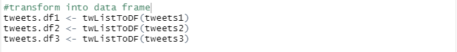
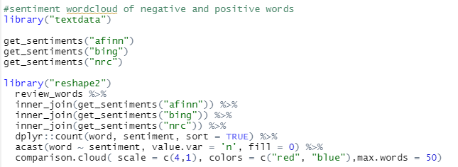

# R Studio Twitter Scrape and Sentiment Analysis

<!-- TABLE OF CONTENTS -->

  
Table of Contents

  <ol>
    <li>
      <a href="#about-the-project">About The Project</a>
      </ul>
    </li>
    <li>
      <a href="#getting-started">Getting Started</a>
      </ul>
         <li><a href="#packages">Packages</a></li>
        <li><a href="#connection">Connection</a></li>
        </ul>
    </li>
    <li><a href="#twitter-api-setup">Twitter API Setup</a></li>
    <li>
      <a href="#scraping-tweets">Scraping Tweets</a>
      <ul>
        <li><a href="#scraping-methods">Scraping Methods</a></li>
        <li><a href="#data-frame">Data Frame</a></li>
        <li><a href="#columns">Columns</a></li>
      </ul>
      <li><a href="#cleaning-tweet">Cleaning Tweet</a></li>
       <ul>
        <li><a href="#url-and-username-symbol">Url and Username Symbol</a></li>
        <li><a href="#hashtag">Hashtags</a></li>
       </ul>
       <li><a href="#analysis">Analysis</a></li>
       <ul>
        <li><a href="#correlation">Correlation</a></li>
        <li><a href="#word-cloud">Word Cloud</a></li>
        <li><a href="#sentiment-analysis">Sentiment Analysis</a></li>
        <li><a href="#sentiment-words-ratio">Sentiment Words Ratio</a></li>
       </ul>
  </ol>

## About The Project

This project was built with RStudio as a means to webscrape tweet off twitter. This  can also be commonly doen in Python, but for I prefer the method of using R to scrape this data and conduct anaylsis. Because of Twitter rules the API only allow scraping of tweets from only as far back as a week ago. This is more that enough though to see current information and make various anaylsis on it which we will be doing here in the form of correlation, sentiment anaylsis and word clouds.

## Getting Started

Make sure you have excel downloaded. If not this should work on the microsofts free online version, the only diffirence is that you cannot edit the vba code there. Make sure macros are enabled in order to run the code.

### Packages

  

### Connection

## Twitter API Setup

In order to setup the API we first need to go to the[Twitter Developer site](https://developer.twitter.com/en) and create and account. Don't worry this is all free and all you need to do is input some info on your project and agree to terms. The 4 main things we will need are, `API key`, `API secret`, `Acess Token`, and `Acess Token secret`. These will be given to us in the developer and our all uniqure to us so do not share it with anyone else. You will be pasting those keys/codes into quotes containg `X`.

  

After all that running this you should see them those 4 as values on the right side in environments. If in the console line it asks to use a local file to cache, type "2" to select No and enter.

## Scraping Tweets

### Scraping Methods

There are three main methods we will be looking at on how to scrape tweets. Getting tweets from that person directly, getting tweets from people "@" tht person or tweets containing there name or keyword.

  

For this example I will be using Walmart and using the 3rd method only and only getting tweets containing the word "Walmart".

### Data Frame
Here we will turn those tweets into a data frame to use it and see it much easier. 

  

### Columns
When we view the data frame we will see there are alot of diffirent data info/columns. The ones we only realy want are the `ScreenName`(The person tweeting), and `Text`(tweet itself).

  

`Distinct(Text)` makes sure we are getting unique tweets and not people saying the same thing due to retweets. You can keep it in though, just remove the distinct code.

## Cleaning Tweet
The tweet in the data frame right now looks very messy so we will go over some ways to clean it up. 

### Url and Username Symbol

* First part cleans by removing any `URL links` people have in their tweet
* Next removes the `:` at the end of an @ mention in order to get rid of the @
* Now that we remove the colon we can get rid of the `@` mention.

### Hashtag
* The first hashtag code removes the entire hashtag word
* Second part just removes the `#` symbol

If you mess up any of these just rerun the tweet1 code that gets the name and column only data frame.

## Analysis

### Correlation
We will look at word correlation among tweets to see which words are mentioned the most and whats the correlation between them.

  

* The `Brocken down words` code breaks down each tweet into its seperate words and we are filtering out the retweet word "rt"
* `Word Frequency` organizing the words by how a minimum amount of times it is mentioned. Here we have a data frame of all the words that are mentioned atleast more than 7 times. 
*  `Word Correlation` sorts words by how closely they are mentioned within each other in the tweets. Increase  0.4 if you want to increase the strength of correlation, up to 1 but you will end up with less results.

  

  

The `Network` will create a network plot of of the word correlation with the color determning how many people are mentioning it. Here is a Function version as well to run it easier.

  

### Word Cloud
Here we will create a colorful wordcloud of the most used words.

  

The size represents the frequency and the color represent words with correlation to each other.

### Sentiment Analysis
This will be are sentiment Analysis were we create a form of a word cloud displaying the most common good and bad words and their density. We will be using 3 diffirent sentiment/lexicon libraries for our sentiment analysis `afinn`, `bing`, and `nrc`. [Refer to this example](https://afit-r.github.io/sentiment_analysis) on understanding the diffirenty lexicons and feel free to use which ever or all 3 as I did.

  

  

If the `Postitive` and `Negative` headers are not showing then click clear all plots and run again.

### Sentiment Words Ratio
Here will look at how to take the ratio of positive to negative words and see the overall score.

  

    

This overall score of 0.39 means that for that week we had 39% of the word sentiments were positive meaning only 39% of the words were overall positive while 61% were ngative.

